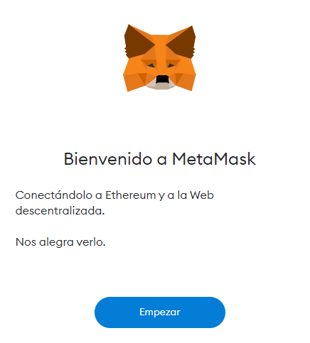
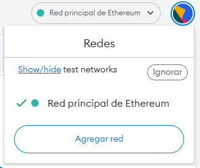
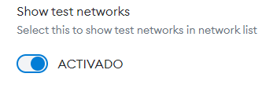
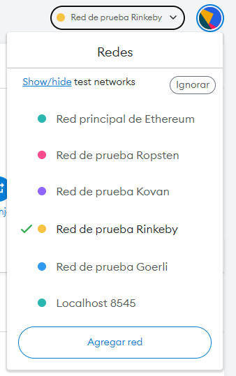
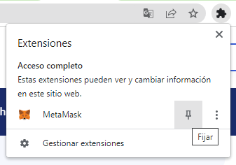
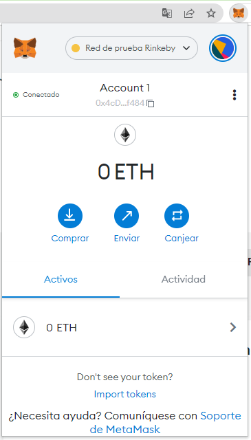

# Tesis Computación

## Creación de una subasta.

## Creación de wallet con Metamask y fondeo con test-eth en rinkeby.

1. En Chrome o Brave instalar la extensión de [Metamask](https://chrome.google.com/webstore/detail/metamask/nkbihfbeogaeaoehlefnkodbefgpgknn?hl=en). 

2. Iniciar el proceso de inicialización en la ventana que se abre. 
    

3. Escoger la opcion de crear una cartera

4. Establecer contraseñas y APUNTAR PALABRAS SECRETAS. 

5. En la esquina superior derecha del wallet aparece la red a la que está conectada la cartera. Hacer click en el vínculo de Show/Hide test networks 

    . 

6. Se abrirá una ventana, activar testnets.

    

7. Cambiar red a Rinkeby 

    

8. Para conseguir eth de rinkeby usar uno de los siguientes faucets [uno](https://faucet.rinkeby.io/), [dos](https://faucets.chain.link/)

9. Recomiendo fijar metamask a la barra de extensiones. 

    

Con lo anterior podrá acceder a su wallet picando el logo de metamask en su wallet.
    

